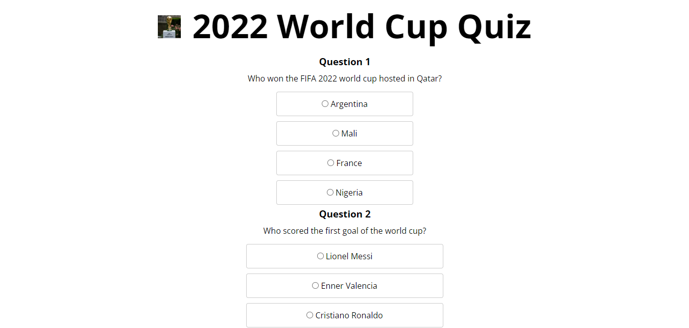
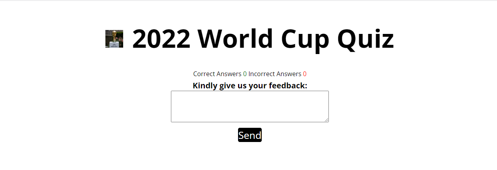
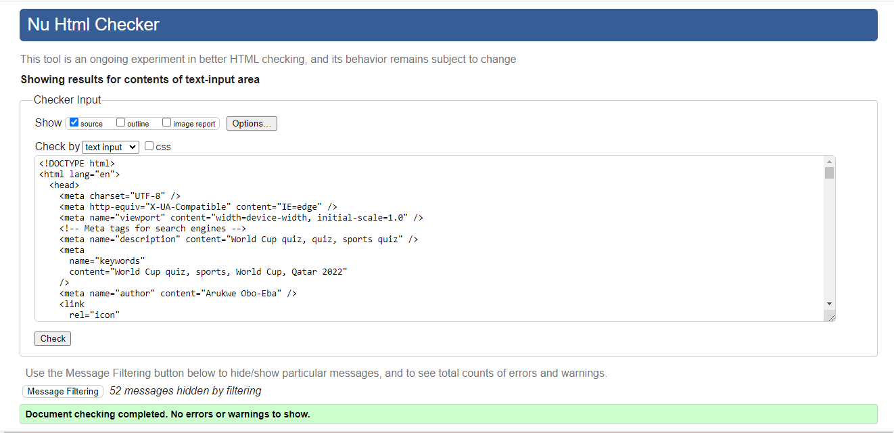
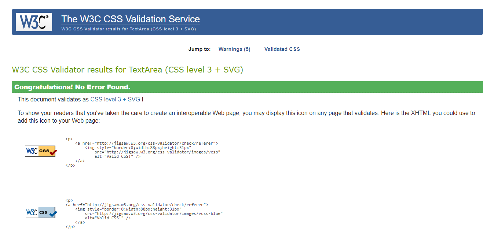
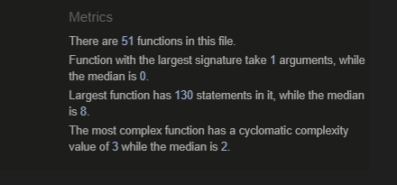
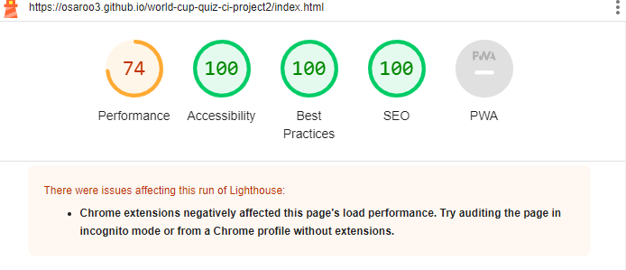

# World Cup Quiz CI Project 2

The idea behind this project, was to have a quiz for football lovers to try their knowledge about the game. The questions here are from the 2022 FIFA World Cup hosted by Qatar and there are 10 questions. After adding your username as requested, you are taken to the quiz. For each question you get right a check mark to support your answer shows besides it and correct answer counter shows what number of answers you got right below, while "X" for wrong answer choices and incorrect counter shows likewise. At the end, your total score is presented to you, and you are requested to provide feedback thereafter.

# Table of content

- [World Cup Quiz CI Project 2](#world-cup-quiz-ci-project-2)
- [Table of content](#table-of-content)
- [User Experience (UX)](#user-experience-ux)
  - [User Stories](#user-stories)
- [Design](#design)
  - [Features](#features)
    - [Existing Features](#existing-features)
    - [Languages Used](#languages-used)
    - [Navigation](#navigation)
    - [Background photo](#background-photo)
    - [Home Page](#home-page)
      - [Quiz Section](#quiz-section)
      - [Feedback Section](#feedback-section)
  - [Future Features](#future-features)
- [Testing](#testing)
  - [Testing User Stories from User Experience (UX) Section](#testing-user-stories-from-user-experience-ux-section)
  - [Validator Testing](#validator-testing)
  - [Fixed Bug](#fixed-bug)
  - [Unfixed Bugs](#unfixed-bugs)
  - [Libraries and Programs Used](#libraries-and-programs-used)
- [Deployment](#deployment)
- [Credits](#credits)
  - [Content](#content)
  - [Media](#media)

# User Experience (UX)

## User Stories

- First Time Visitor Goals
  - As a first time visitor, I want to know the purpose of this site.
  - As a first time visitor, I want navigate the site intuitively.
  - As a first time visitor, I want to look for testimonials to know what others think.

- Returning Visitor Goals
  
  - As a returning visitor, I want to see what changes/ improvements have been made to the site.

- Frequent User Goals

  - As a frequent user, I want to see if new quiz questions have been added.
  - As a frequent user, I want to see if the comments of users impact changes on the site.

# Design

The choice of color, typography and images, used were chosen for simplicity and, also for how visually appealing they can be to site users.

## Features

### Existing Features

### Languages Used

- HTML5
- CSS3
- JavaScript

### Navigation

There is one navigation included in this site. It is linked to the send button-like div to receive users feedback. Once that "send" is clicked it navigates to the index page.

### Background photo

A main photo is used in the index page to capture the users attention, expecially as it is the official logo of the 2022 FIFA world cup held in Qatar.

### Home Page

This page engages with our site users, by providing information about the quiz, which helps our users exercise their wits.

#### Quiz Section

The quiz section is on the index page...just hidden, only to be revealed when the user enters a username. The user has to scroll down to access othe quiz questions.

#### Feedback Section

The feedback section exists to get users reaction and possible ideas to improve the quiz page.

## Future Features

- Make th quiz display one by one, with the next page coming up once the user clicks next.
- Add more questions and include quiz from othe world cup years.
- Add testimonies of users who take the quiz.

# Testing

I have checked to confirm that the user cannot access the quiz without providing a username.

I have ensured that this project is responsive on all screens.

## Testing User Stories from User Experience (UX) Section

- First Time Visitor Goals
  - As a first time visitor, I want to know the purpose of this site.
      1. Every first time visitor can clearly see that this is a FIFA world cup quiz site.
      2. The site is there to test their sports knowledge about football.
  - As a first time visitor, I want navigate the site intuitively.
      1. Navigating the site is very intuitive, as how to navigate the site is easy and, the needed response from users are clear and unambiguous.
  - As a first time visitor, I want to look for testimonials to know what others think.
      1. At the moment testimonies of users are not public yet. That is currently under consideration.

- Returning Visitor Goals
  
  - As a returning visitor, I want to see what changes/ improvements have been made to the site.
      1. Further changes are currently under consideration, however, there is no specific time for their implementation.

- Frequent User Goals

  - As a frequent user, I want to see if new quiz questions have been added.
      1. No new changes to the site yet.
  - As a frequent user, I want to see if the comments of users impact changes on the site.
      1. It certainly will. However, implementation is yet to take place.

## Validator Testing

- HTML: No errors or warnings shown when passed via the official W3C validator:

- CSS: No errors shown when passed via the official (Jigsaw) validator:

-js: No errors were found.

-Lighthouse audit: Archieved 100% accessiblity, best practices and SEO checks. However, the site performance is at 74% - the lowest. This issue has to do with my chrome extension.

## Fixed Bug

- I was'nt able to call the user's name entry before telling them their quiz score. This issue was based on the variable assigned to the name entry being block scoped. I fixed this issue by declaring the variable outside the scope making it a global varaiable.

## Unfixed Bugs

- Yet to fix my chrome extension issues affecting the site's performance rating.

## Libraries and Programs Used

- Github: To Store Repository
- Codeanywhere: To Create the html and css files
- Google Fonts: Font-family 'Open Sans' and fallback "sans serif"
- Google Chrome Dev Tools: For testing.
- Microsoft Edge: Alternative browser for site testing
- Font Awesome: Social media icons
- Am I Responsive: Getting image of how the webpage renders on different screen sizes.

# Deployment

The site was deployed to GitHub pages. The steps or deploy are shwon below:

  1. Go to GitHub repository, click on the project.
  2. Click 'settings' and also click 'Pages'.
  3. Select 'Main' from drop-down menu under branch, and click save.
  4. A link to the live page will appear .

The live link for this site can be found here -[link](https://osaroo3.github.io/world-cup-quiz-ci-project2/index.html)

# Credits

I wish to thank my mentor Martina Terlevic for all the support so far, and to Code Institute and its slack community, I say a big thanks.

1. The tools to make this page come alive comes from Code Institutes Love maths, love running walkthrough project and Aerobic yoga project 1.
2. I acknowledge Code Institute's sample README and Tulkerfaulk for the readme file structure.
3. The correct and incorrect scores counter code was gotten from love maths.

## Content

The quiz content was sourced from : [FIFA](https://www.fifa.com/fifaplus/en/tournaments/mens/worldcup/qatar2022/scores-fixtures?country=GB&wtw-filter=ALL)

## Media

Images:

The FIFA trophy image was sourced from : [Google search](https://www.aljazeera.com/sports/2023/3/14/fifa-confirms-expanded-2026-world-cup-with-record-104-matches)

The offial 2022 world cup image was sourced from : [Google search](https://upload.wikimedia.org/wikipedia/en/thumb/e/e3/2022_FIFA_World_Cup.svg/800px-2022_FIFA_World_Cup.svg.png)

The faveicon was sourced from : [Flaticon](https://www.flaticon.com/free-icon/world-cup_8861317?term=world+cup&page=1&position=2&origin=search&related_id=8861317)
