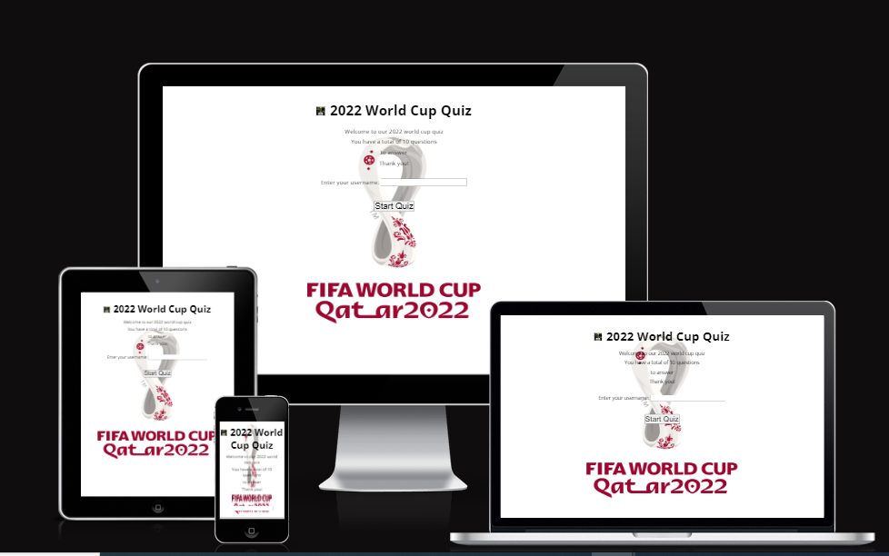
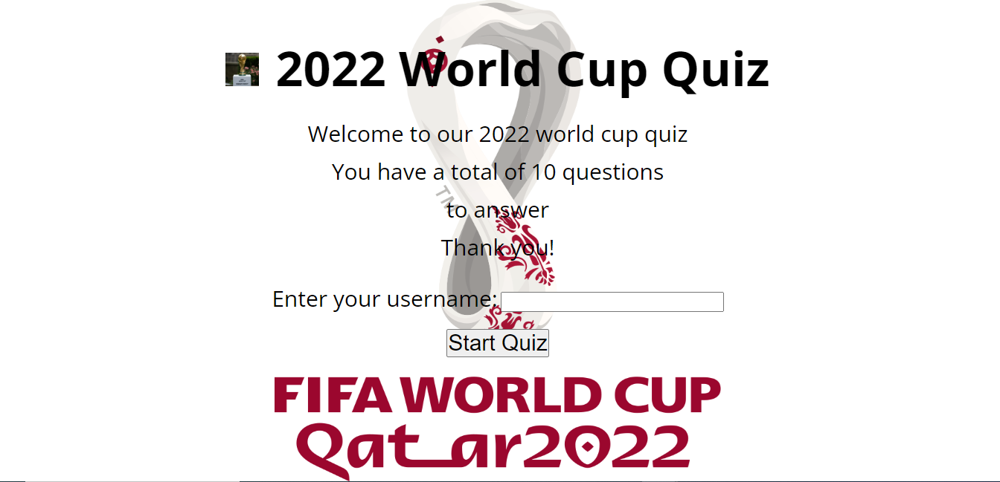

# WORLD CUP QUIZ CI PROJECT 2

The idea behind this project, was to have a quiz for football lovers to try their knowledge about the game. The questions here are from the 2022 FIFA World Cup hosted by Qatar and there are 10 questions. Ater adding your username as requested, you are taken to the quiz. For each question you get write a check mark to support your answer shows besides it and correct answer counter shows what number of answers you got write below, while "X" for wrong answer choices and incorrect counter shows likewise. At the end your total score is presented to you and you are requested to provide feedback thereafter.

# Table of content

- [WORLD CUP QUIZ CI PROJECT 2](#world-cup-quiz-ci-project-2)
- [Table of content](#table-of-content)
- [Design](#design)
- [Features](#features)
  - [Existing Features](#existing-features)
    - [Languages Used](#languages-used)
    - [Navigation](#navigation)
    - [Home Page main photo](#home-page-main-photo)
    - [Home Page](#home-page)
      - [Benefits?](#benefits)
      - [Why with us?](#why-with-us)
      - [Our location?](#our-location)
    - [Gallery page](#gallery-page)
    - [Sign up page](#sign-up-page)
      - [Footer](#footer)
  - [Future Features](#future-features)
- [Testing](#testing)
  - [Validator Testing](#validator-testing)
  - [Unfixed Bugs](#unfixed-bugs)
  - [Libraries and Programs Used](#libraries-and-programs-used)
- [Deployment](#deployment)
- [Credits](#credits)
  - [Content](#content)
  - [Media](#media)

# Design

The choice of color, background-color, font and font-family where chosen for simplicity and, also for how visually appealing they can be to site users.

# Features

## Existing Features

### Languages Used

- HTML5
- CSS3
- JavaScript

### Navigation

There are three navigation links in this project, and they are located at the top right side of the users screen. However, for phone screen, because of its size the navigation link has been compessed into an icon (bars), so that, when clicked the users have access to these navigation links. They can be accessed easily, and also there to enable users navigate between the three pages of this website.

### Home Page main photo

A main photo is used in the index page as the hero image. This is done to draw the attention of the site users to what happens in our studio. The goal is to gain their approval of what we do, and, for them to sign up.

### Home Page

This page engages with our site users, by providing information about what we do, its benefits, why they should sign up, our location and, also our social handles.

#### Benefits?

This section provides our site users with some major benefits of aerobic yoga to them, so as to get them to sign up..

#### Why with us?

This section has been included to gain our users trust, to enable them not only to sign up for aerobic yoga exercises, but also, for them to choose us.

#### Our location?

This section details where we meet as a group.

### Gallery page

This page shows some images from our activities as our way of encouraging more people to exercise with us.

### Sign up page

The sign up page is where we take information about those joining our group. This is to enable us to enrol them, and, also keep in touch with them.

#### Footer

The footer section directs our site users to our social handles to keep up with updates regarding our activities.

## Future Features

- Add videos of our activities.
- Add testimonies of people, who sign up with us, on our website.

# Testing

Testing of the website was done by me. I open the link on different browsers (Chrome and MS Edge) to be certain they where rendered as I expected. Certain html contents where out of position. This was corrected using appropriate CSS styling.

I have checked to confirm that forms cannot be submitted without valid entries.

I have ensured that this project is responsive on all screens.

## Validator Testing

- HTML: No errors or warnings shown when passed via the official W3C validator:

- CSS: No errors or warnings shown when passed via the official (Jigsaw) validator:

-Lighthouse audit: Archieved excellent accessiblity, best practices and SEO checks. However, the site performance is at 52%. This issue as stated has to do with my chrome extension.

## Unfixed Bugs

- Yet to center the cover text both verically and horizontally.
- Yet to fix my chrome extension issues affecting the site's performance rating.

## Libraries and Programs Used

- Github: To Store Repository
  Codeanywhere: To Create the html and css files
- Google Fonts: Font-family 'Montserrat' and 'Open Sans'
- Google Chrome Dev Tools: For testing.
- Microsoft Edge: Alternative browser for site testing
- Font Awesome: Social media icons
- Am I Responsive: Getting image of how the webpage renders on different screen sizes.

# Deployment

The site was deployed to GitHub pages. The steps or deploy are shwon below:

  1. Go to GitHub repository, click on the project.
  2. Click 'settings' and also click 'Pages'.
  3. Select 'Main' from drop-down menu under branch, and click save.
  4. A link to the live page will appear .

The live link for this site can be found here -[link](https://osaroo3.github.io/Aerobic_Yoga_CI_Project1/index.html)

# Credits

The journey to becoming a Fullstack software developer has been great so far, and, also challenging. I wish to thank my mentor Martina Terlevic for all the support so far, and to Code Institute slack community, I say a big thanks.

1. The framework of this page follows that of Code Institutes Love Running walkthrough project.
2. I acknowledge Tulkerfaulk for the readme file structure.
3. The coders coffee project came in handy too.
4. dh dance school location was used in this website for educative purposes.

## Content

The text content of the index page was sourced from : [Link](https://www.webmd.com/fitness-exercise/what-are-aerobic-exercises#:~:text=Aerobic%20exercise%20is%20cardiovascular%20exercise,that%20gets%20to%20your%20muscles.)

## Media

Images:

All images were sourced from : [pexels](https://www.pexels.com/)

All faveicons were sourced from : [Flaticon](https://www.flaticon.com/free-icons/yoga/)
